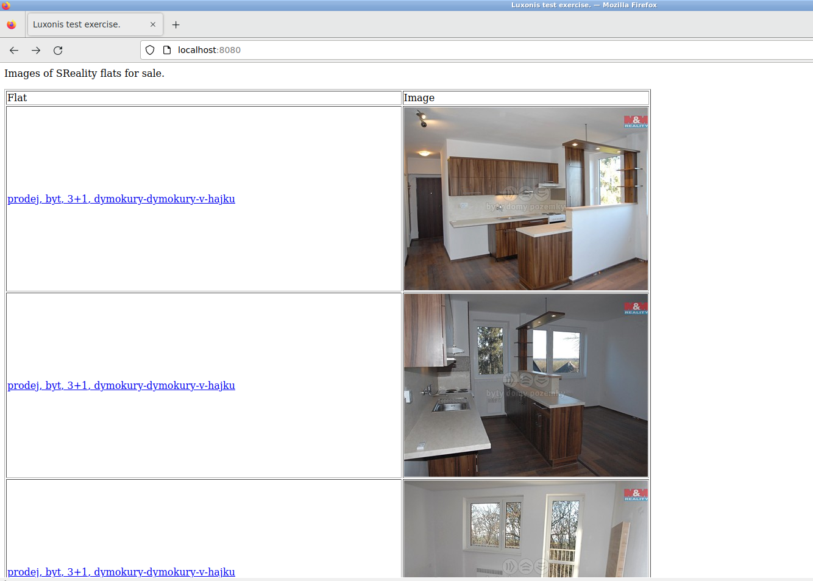

# sreality-scraper 

- Scraping first 500 image urls of flats from https://www.sreality.cz/hledani/prodej/byty and saving it to Postgresql
- Loading urls from database and showing images on http://localhost:8080.

### Usage

`docker-compose up`

### Expected result (tested on Linux)

